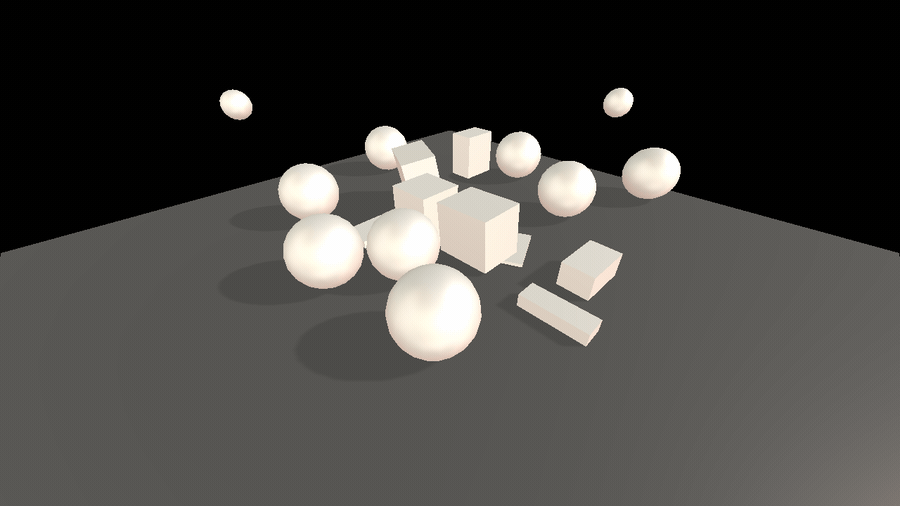

<h1 align="center">🎳 Three.js Physics</h1>

<p align="center">Click to rain down spheres and boxes that fall, bounce, collide, and clatter — a real-time physics sandbox pairing Three.js rendering with a Cannon.js simulation.</p>

<p align="center">
  <a href="https://threejs-physics.netlify.app/"></a>
</p>

<p align="center">
  
</p>

<p align="center">
  
  
  
  
  
</p>

## About

Two worlds running in sync: **Three.js** draws the scene while **Cannon.js** runs the physics. Every frame, the simulated bodies' positions and rotations are copied onto their visual meshes.

- 🟢 Spawn random spheres and boxes from the on-screen controls
- 💥 Realistic gravity, restitution (bounce), and collisions against the floor and each other
- 🔊 Collision-triggered hit sounds, with impact strength gating playback
- ♻️ A reset button to clear the scene and remove bodies from the world

## Tech

Three.js · Cannon.js · WebGL · physics-to-render sync loop · lil-gui · Vite

## Run locally

```bash
npm install   # first time only
npm run dev   # local server at localhost:8080
npm run build # production build in dist/
```

---

<p align="center"><i>Part of my Three.js journey · <a href="https://estebanacuna.dev">estebanacuna.dev</a></i></p>
